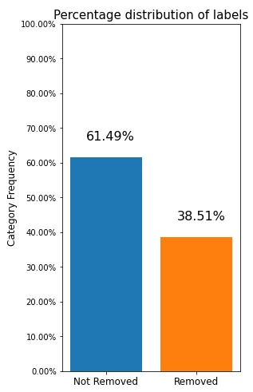
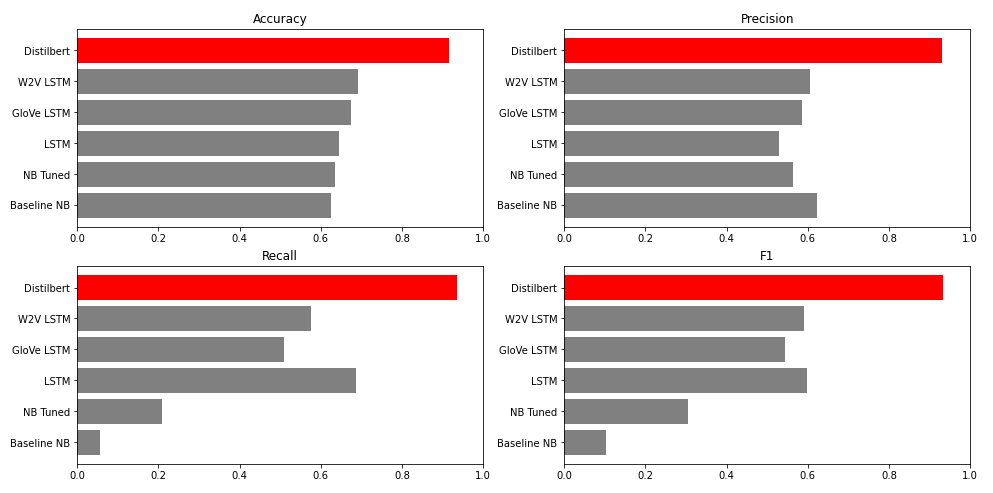
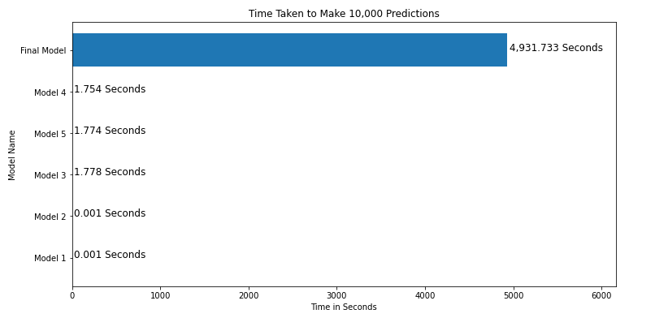
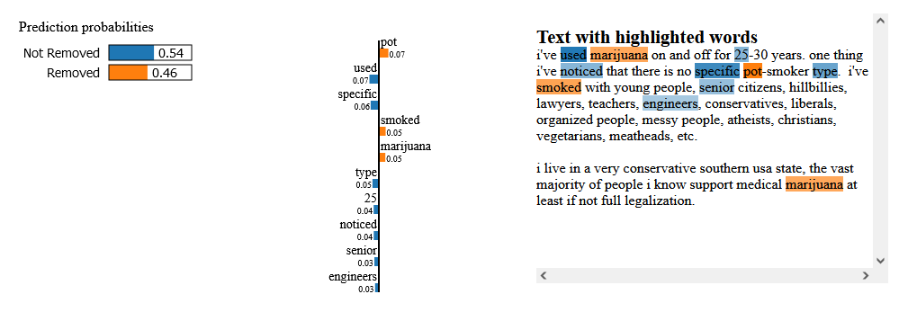

# Comment Classification Project
**Author:** Kai Uechi

## Overview
The goal of this project is to train neural networks for automated content moderation. 
The best model created was able to correctly identify which comments to remove with 91.6% accuracy.
Additionally, combining the model with a text explainer allows for insight into the behavior of the neural network, and evaluation of the effectiveness of current moderation policies.
However, if given more computing resources it may be possible to create a more accurate model.

## Business Problem
As companies such as Twitter and Meta face challenges with racist, sexist and even criminal user-generated content, Reddit sees this as an opportunity to expand.
However, an increase in user-generated content carries risk: 
Existing community-run moderation systems have difficulty handling the increase in trolls and bad content.

In an attempt to combat this issue and enable the site to grow, this project investigates applying machine learning and neural networks to automate content moderation.
The final aim of this investigation being the creation of a more efficient moderation system that allows boards to better scale to high numbers of users.

## Data Understanding
The dataset used for this project is a selection of `223,372` reddit comments from the r/science board.

Several features are included in the dataset, but the only ones used in for this project are:
*    `body`: This contains the actual text content
*    `REMOVED`: This specifies if the comment was removed or not
    
    
The length and content can vary greatly from one comment to the next.
`86,016` of the comments were removed my moderators, while the other `137,356` were not.

The graph below visualizes the dataset's label distribution.




## Data Preprocessing

The data preprocessing steps are as follows:
* Concatenate both train and test sets to a single dataset
* Drop unused columns
* Set all text to lowercase
* Remove all special characters and stopwords 
* Tokenize and lemmatize text 
* Remove rows that no longer contain text

Additionally, some messages appear to be automated removal notifications, rather than user comments.

Since these are not representative of the sort of content the model will be moderating, they have been removed.

## Modeling

The next step in the project is to train and optimize a model to be used for content moderation.
Several types of models are created and compared with each other to determine the best performing model.

The model types used are:
* Naive Bayes
* Long Short-Term Memory Network
* Transformer

The first model is created as a baseline, using Naive Bayes. A second, better tuned Naive Bayes model improves performance slightly.
Next, a long short-term memory (LSTM) model is created, resulting in a moderate increase in accuracy. This LSTM model is tuned to incorporate external embeddings, which significantly improves the model's performance. Of the two types of embeddings tested, Word2Vec embeddings provided the largest increase to accuracy. Finally, Distilbert (a transformer architecture model) is trained on the dataset. This model vastly outperforms all previous model types and is therefore selected as the projects final model.


## Conclusion

### Model Evaluation
When comparing the metrics of the different models, there are several conclusions:
* On it's own, LSTM architecture performs only slightly better than Naive Bayes.
    * Despite being more computationally intensive, the basic LSTM model only achieves 1% higher accuracy compared to the tuned Naive Bayes model.
* If LSTM is combined with external embeddings it becomes much more effective.
    * A significant (2.8 - 4.8%) increase in accuracy can be seen in both cases where external embeddings are given to the model, although the Word2Vec embeddings performed better.
* Transformer architecture vastly outperformed all other models.
    * The distilbert model achieved the best scores by far: 91.6% accuracy, 22.3% better than the next best model.

The distilbert model has the best performance by far, and is therefore chosen as the final model for this project.
However, as the next section will discuss, the speed of this final model is a limiting factor under the specific circumstances of this project.

The graphs below show the scores of the models for various metrics. The final model's scores are highlighted in red.



### Model Speed

This section compares the speed of the models, rather than their accuracy.

The results are as follows:
*	The fastest models are the low accuracy Naive Bayes models, performing predictions on the entire test set in under a second.
*	The LSTM models are slower than the Naive Bayes models, taking around 7 seconds to make predictions on the test set.
*	The final model is much slower, taking over 10 seconds to complete just 16 predictions. 
	Based on this, I predict it would take several hours to make predictions for the whole test set.

Because this project deals with content moderation for a forum, not a live chatroom, the final model does not need to be instantaneous. By allocating additional resources, I expect the final model could achieve sufficient speed to be used for this task.

In the case of this project, however, this slow speed makes the final model very difficult to work with.
Therefore, the next best model (LSTM + Word2Vec) is used in its place for the following sections.

The graph below visualizes this difference in speed between the models.



### Model Explanation

Having an explainable model is a significant benefit, as understanding why the model makes the decisions it does allows one to ensure the model is following sound logic.
The image below shows the explanation of the models prediction for a particular comment.
Words that are highlighted in orange increase the likelihood of removal, while words highlighted in blue do the opposite.
Note that the word "pot" is more likely to result in removal compared to the word "marijuana", although both words increase the chance.

In the case of content moderation, this explainability can provide an additional benefit: 
Because the model is trained on comments filtered by the current moderation system, 
these explanations provide insight into current moderation practices. 
Having an understanding what sort of words get comments removed could give insight on how moderation policies might be improved.



The following video provides a demonstration of this model explanation in action:

https://user-images.githubusercontent.com/65979472/205458646-c3facd63-6a8b-4c30-ade1-e2be52129288.mp4

### Deployment Considerations

The final model's accuracy of 91.6% is certainly sufficient to be of use if deployed to help automate content moderation.
However, allowing the model to directly remove comments is not recommended, as although the model's accuracy is high, it is far from flawless.
Even if it only happens occasionally, having a comment removed unfairly is a major inconvenience from the perspective of a user.
Thus, the risks of deploying the model in this way outweighs the potential benefit.

The solution this project proposes is to have the model tag and withhold comments that it detects as being in violation of the rules, rather than remove them outright.

A human moderator can then check tagged comments and make the final decision on removal.
Human involvement also allows for citing which rule the offending comment has broken, which the model is incapable of doing on its own.
This will stop most unwanted content from reaching other users, significantly reducing the need for users to report comments.
This results in a better overall user experience, which will promote user engagement.

## Next Steps
* Further explore potential of transformer architecture models
	* Given that Distilbert is a lighter-weight version of the original Bert model, it's likely that more powerful models could be created if given more computing resources to train and tune them.
* Investigate more advanced methods of model explanation
    * The text explainer used in this project, lime, achieves its results from a brute force approach. A more robust model explainer could yield deeper insights, especially if it could leverage transformer architecture's attention system.

## For More Information

Review the [Jupyter Notebook](./comment-classification.ipynb) or the [presentation](./comment-classification_ProjectPresentation.pdf).

For any additional questions, please contact **Kai Uechi (kaiuechi@gmail.com)**

## Repository Structure
***

    ├┬─ data  -Contains the original dataset and its cleaned variants
    │└─ glove -Contains the .txt files for GloVe embeddings
    ├── flask -Contains the files used to run the flask model demonstration
    ├── images  -Contains images used in README
    ├── models  -Contains the project's models and their training history
    ├── README.md  -Overview of project and repo contents
    ├── comment-classification_ProjectPresentation.pdf  -A slide deck for presenting this project
    └── comment-classification.ipynb  -The final notebook for this project.

```python
